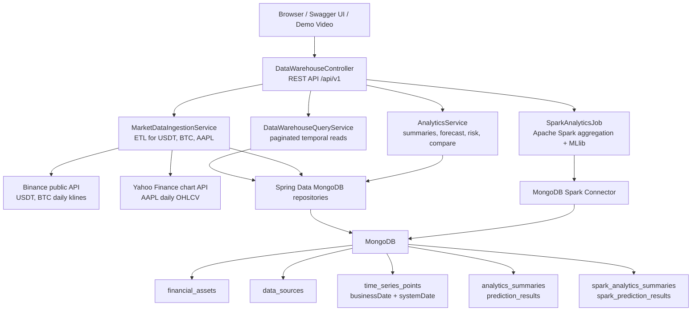

# Architecture Diagram

This project is organized as a layered Spring Boot data warehouse. The diagram below is intentionally included in the repository so the offline evaluator can see the architecture without running the application.

## Temporal Rules

- Market time is stored in `businessDate`.
- Version time is stored in `systemDate`.
- Time-series writes are append-only.
- Logical deletes are represented by new records with `metadata.deleted=true`.
- API queries return only the newest `systemDate` version for each `businessDate`.

## Data Flow

1. `POST /api/v1/ingest` routes `USDT` and `BTC` to Binance and `AAPL` to Yahoo Finance.
2. External OHLCV JSON is transformed into `TimeSeriesPoint.values`.
3. Existing latest versions are compared before insert, so reruns skip unchanged records.
4. `GET /api/v1/data` reads only temporally correct latest versions.
5. `POST /api/v1/analytics/spark/run` reads MongoDB with Spark, aggregates yearly Close values, trains Linear Regression, and writes results back to MongoDB.
